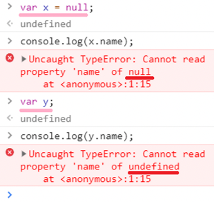

이웅모, 『모던 자바스크립트 Deep Dive』, 위키북스, 2020.

# 9장 타입 변환과 단축 평가
## 4. 단축 평가(Short-Circuit Evaluation)

> 단축 평가란, 표현식을 평가하는 도중에 평가 결과가 확정된 경우 **나머지 평가 과정을 생략**하는 것을 의미한다.

### 1. 논리 연산자를 사용한 단축 평가
- 논리합(`||`) 또는 논리곱(`&&`)의 평가 결과는 불리언 값이 아닐 수도 있다.

- 평가 결과를 결정하는 피연산자가 그 평가 결과(=값)가 된다.

    `"Cat" || "Dog"` -> `"Cat"`

    `"Cat" && "Dog"` -> `"Dog"`

  - 즉, 논리 연산의 결과를 결정하는 피연산자를 **타입 변환하지 않고 그대로 반환**한다.

- 단축 평가는 다음과 같은 상황에서 유용하게 사용될 수 있다. :

  - 어떤 객체의 프로퍼티를 참조해야 할 때, 해당 객체가 존재하는지를 먼저 판별해야 할 때

    ```js
    const me = null;

    const myName = me.name;

    /* TypeError: Cannot read properties of null (reading 'name') */
    console.log(myName);
    ```

    단축 평가를 활용하면 에러를 방지할 수 있다.

    ```js
    const me = null;

    const myName = me && me.name;

    console.log(myName); // null
    ```

  - 매개변수의 기본값을 설정하고 싶을 때

    인자를 전달하지 않을 경우 매개변수에 `undefined`가 할당된다.

    ```js
    function getStringLength(str) {
        console.log(str.length);
    }

    getStringLength("test"); // 4
    /* TypeError: Cannot read properties of undefined (reading 'length') */
    getStringLength();
    ```

    단축 평가를 활용하여, 인자를 전달하지 않을 경우 발생하는 에러를 방지할 수 있다.

    ```js
    function getStringLength(str) {
        const _str = str || "";
        console.log(_str.length);
    }

    getStringLength(); // 0
    ```

  > 에러가 발생하면 프로그램이 강제 종료되는데, 위와 같이 단축 평가를 활용하여 예외 케이스에서도 프로그램이 종료되지 않도록 방지할 수 있다.

### 2. 옵셔널 체이닝 연산자(optional chaining operator)
```js
피연산자(프로퍼티를 참조하려는 객체의 식별자)?.좌항 피연산자의 프로퍼티
```

- ES11(ECMAScript2020)에서 새롭게 도입되었다.

- `?.`에서, `.`을 마침표 프로퍼티 접근 연산자로 생각하면,

  - 좌항 피연산자가 `null` 또는 `undefined`인 경우 -> `undefined`를 반환한다.

  - 좌항 피연산자가 `null` 또는 `undefined`가 아닌 경우 -> 우항의 프로퍼티 참조를 이어간다.

- 사용 목적

  어떤 객체의 프로퍼티를 참조하려고 할 때, 해당 객체를 가르킬 것으로 기대하는 **변수**가 `null` 또는 `undefined`일 경우 TypeError가 발생한다. 이러한 TypeError가 발생하는 것을 방지하기 위해 옵셔널 체이닝 연산자를 사용한다.

  

  > 🤔: 에러 방지가 목적이라면 앞서 살펴본 논리곱(`&&`) 단축 평가를 사용하면 되는 것 아닌가?

  - 옵셔널 체이닝 연산자 🆚 논리곱 단축 평가

    - 옵셔널 체이닝 연산자: 좌항 피연산자가 `null` 또는 `undefined`인 경우에만 대응한다.

    - 논리곱 단축 평가: 좌항 피연산자가 falsy 값인 모든 경우에 대응한다. 즉 좌항 피연산자가 falsy할 경우 그 값을 그대로 반환한다.

    > falsy 값: `false`, `undefined`, `null`, `0`, `-0`, `NaN`, `''`

    ```js
    const target1 = "";
    const target2 = null;

    /* -------------------------------------------------------------------------- */
    /*                                    단축 평가                                   */
    /* -------------------------------------------------------------------------- */
    const len1 = target1 && target1.length;
    const len2 = target2 && target2.length;

    console.log(len1); // 예상: 0, 실제: "" 🙅🏻‍♀️
    console.log(len2); // null

    /* -------------------------------------------------------------------------- */
    /*                                   옵셔널 체이닝                                  */
    /* -------------------------------------------------------------------------- */
    const len3 = target1?.length;
    const len4 = target2?.length;

    console.log(len3); // 예상: 0, 실제: 0 🎉
    console.log(len4); // undefined
    ```

### 3. null 병합(nullish coalescing) 연산자

```js
좌항 ?? 디폴트값
```

- 'coalesce' = '합치다'

- null 병합 연산자도 ES11(ECMAScript2020)에서 도입되었다.

- `좌항 ?? 디폴트값`에서,

  - 좌항 피연산자가 `null` 또는 `undefined`인 경우 -> 우항의 피연산자(디폴트값)를 반환한다.

  - 좌항 피연산자가 `null` 또는 `undefined`가 아닌 경우 -> 좌항의 피연산자를 반환한다.

- null 병합 연산자는 변수에 기본값을 설정할 때 유용하다.

  - cf.) 논리 연산자 `||`를 이용한 단축 평가를 사용하는 방법도 가능하지만, 이 방법은 null 병합 연산자와 달리 falsy한 모든 값에 대응한다. (즉, 좌항의 피연산자가 `null` 또는 `undefined`인 경우 뿐만 아니라 falsy한 모든 경우에 우항의 피연산자를 반환하게 됨.)
