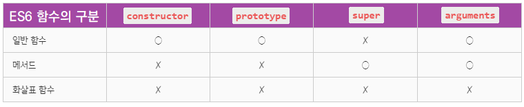

참고: 
[26장 예제코드](https://github.com/wikibook/mjs/blob/master/26.md).
[웹 프로그래밍 튜토리얼 | Poiemaweb](https://poiemaweb.com/)
이웅모, 『모던 자바스크립트 Deep Dive』, 위키북스, 2020. 

26.1~26.3장 by 안예인 (ahnanne)

## 26.1 함수의 구분
- ES6 이전의 함수는 사용 목적에 따라 명확히 구분되지 않았음.

  - 즉, ES6 이전의 모든 함수는 **callable**이면서 **constructor**이다.

    ```
    - callable : 호출할 수 있는 함수 객체
    - constructor : 인스턴스를 생성할 수 있는 함수 객체
    - non-constructor : 인스턴스를 생성할 수 없는 함수 객체
    ```

  - 객체에 바인딩된 함수(=메서드)도 마찬가지

  - 어떤 함수가 constructor라는 것은 프로토타입 객체를 생성한다는 것을 의미함. 즉 ES6 이전의 메서드는 프로토타입 객체를 생성할 필요가 없음에도 불구하고 그렇게 생성하고 있었던 것임.

  - 이로 인해 실수 유발 가능성도 높았고, 성능 측면에서도 문제가 있었다고 함.

  - 이러한 문제를 해결하기 위해 ES6에서는 함수를 사용 목적에 따라 다음과 같이 세 가지 종류로 명확히 구분하게 되었다.

    

## 26.2 메서드
- ES6 메서드는 본연의 기능(`super`)을 추가하고, 의미적으로 맞지 않는 기능(`constructor`)은 제거했음.

- ES6 이전 사양에는 '메서드'에 대한 명확한 정의가 없었고, 보통은 객체에 바인딩된 함수를 일컫는 의미로 사용되었음.

- ES6 사양에서는 메서드에 대한 정의가 명확하게 규정됨.

  - ES6 사양에서의 메서드는 **메서드 축약 표현**(=`function` 키워드를 생략한 축약 표현)으로 정의된 함수만을 의미한다.

- ES6 메서드는 non-constructor

  - 즉, ES6 메서드는 인스턴스를 생성할 수 없으므로, (불필요한) 프로토타입도 생성하지 않는다.

  - ES6 메서드는 '자신을 바인딩한 객체'를 가리키는 내부 슬롯인 [[HomeObject]]를 가짐.

    - `super` 참조는 이 내부 슬롯 [[HomeObject]]를 사용하여 *수퍼클래스*의 메서드를 참조하므로, ES6 메서드는 `super` 키워드를 사용할 수 있다.

### Note: 화살표 함수와 함수 호이스팅
```js
func();

const func = () => {
  func2();
};

const func2 = () => {
  console.log(1);
};
```
(위 코드에서 `func`를 함수 선언문으로 바꿔서 작성하면, 함수 호이스팅으로 인해서 에러없이 실행이 됨.)

화살표 함수는 함수 호이스팅이 되지 않는 이유:

  1. <b>함수 선언문</b>으로 정의한 함수와 <b>함수 표현식</b>으로 정의한 함수는 함수 생성 시점이 다르다. 함수 선언문으로 함수를 정의하면 런타임 이전에 함수 객체가 이미 생성이 되는 반면, 함수 표현식으로 함수를 정의하면 런타임(즉 해당 할당문 실행 시점)에 함수 객체가 생성된다. (참고: [함수 호이스팅](https://poiemaweb.com/js-function#2-%ED%95%A8%EC%88%98-%ED%98%B8%EC%9D%B4%EC%8A%A4%ED%8C%85))
      - 함수 선언문의 경우, 함수 선언의 위치와는 상관없이 코드 내 어느 곳에서든지 호출이 가능한데, 이를 함수 호이스팅(function hoisting)이라고 한다.
  2. 함수 표현식으로 함수를 정의하면 함수 호이스팅이 발생하는 것이 아니라 변수 호이스팅이 발생한다. 즉 변수 자체는 런타임 이전에 선언이 되어서 `undefined`로 초기화가 되지만, 할당문은 런타임 이전에 실행이 되지 않아 함수 객체가 생성되지 않은 상태라서 `ReferenceError: Cannot access 'func' before initialization` 라는 에러 메시지가 뜬다. (cf. 만약 변수가 선언이 되지 않은 상태라면 `ReferenceError: func is not defined`라는 에러 메시지가 떴을 것)
  3. 화살표 함수는 함수 선언문으로 정의할 수 없고 함수 표현식으로 정의해야 한다. 즉 함수 선언문으로 정의할 수 없으므로 함수 호이스팅이 발생할 수 없다. (참고: [화살표 함수의 호출](https://poiemaweb.com/es6-arrow-function#2-%ED%99%94%EC%82%B4%ED%91%9C-%ED%95%A8%EC%88%98%EC%9D%98-%ED%98%B8%EC%B6%9C))

___

26.3~26.4장 by 이은민 (gcount85)

## 26.3 화살표 함수
- 화살표 함수<sub>arrow function</sub>는 `function` 키워드 대신 화살표(`=>`, fat arrow)를 사용하여 함수를 정의하는 방식 (※ `=>`는 `return`의 의미를 띤다고 생각하기)
- 기존 함수 정의 보다 간략하게 함수를 정의함
- 표현 뿐 아니라, 내부 동작도 기존의 함수보다 간략함 
- 화살표 함수는 콜콜백 함수 내부에서 `this`가 전역 객체를 가리키는 문제를 해결하기 위한 대안으로 유용함 
### 26.3.1 화살표 함수 정의
#### 함수 정의
- 함수 표현식으로 정의
- 호출 방식은 기존 함수와 동일
```js
const multiply = (x, y) => x * y;
multiply(2, 3); // -> 6
```

#### 매개변수 선언
- 매개변수가 여러 개면 소괄호 `()` 안에 매개변수 선언 
- 매개변수가 한 개면 소괄호 `()`를 생략함
- 매개변수가 없는 경우 소괄호 `()`를 생략할 수 없음 
```js
// 매개변수 여러 개 일때
const arrow = (x, y) => { ... };

// 매개변수 한개일 때
const arrow = (x) => { ... }; 
const arrow = x => { ... };

// 매개변수 없을 때
const arrow = () => { ... }; 
```

#### 함수 몸체 정의 
1. 함수 몸체가 **하나의 문**으로 구성되는 경우
- 함수 몸체를 감싸는 중괄호 `{}`를 생략할 수 있음
- 이때 함수 몸체 내부의 문이 **값으로 평가될 수 있는 표현식**이면 암묵적으로 반환 됨 
```js
// concise body
const power = x => x ** 2;
power(2); // -> 4

// 위 표현은 다음과 동일하다.
// block body
const power = x => { return x ** 2; }; // x ** 2는 값으로 평가될 수 있기에 중괄호와 return 생략O
```
- 하지만, 하나의 문으로 구성되어도 **표현식이 아닌 문**은 에러가 발생함 → 반환 값이 없기 때문 → 따라서 중괄호 `{}`를 생략할 수 없음
```js
const arrow = () => const x = 1; // SyntaxError: Unexpected token 'const'

// 위 표현은 다음과 같이 해석된다.
const arrow = () => { return const x = 1; }; // error

// 다음과 같이 표현하는 것이 적절함
const arrow = () => { const x = 1; }; // return을 없앴다
```
- 객체 리터럴을 반환하는 경우, 객체 리터럴을 소괄호 `()`로 감싸주어야 함 
```js
const create = (id, content) => ({ id, content });
create(1, 'JavaScript'); // -> {id: 1, content: "JavaScript"}

// 위 표현은 다음과 동일하다.
const create = (id, content) => { return { id, content }; };

// 소괄호 () 없이 아래와 같이 쓰면 안 된다!
// { id, content }를 함수 몸체 내의 쉼표 연산자문으로 해석한다.
const create = (id, content) => { id, content };
create(1, 'JavaScript'); // -> undefined
```
2. 함수 몸체가 **여러 개의 문**으로 구성되는 경우
- 함수 몸체를 감싸는 중괄호 `{}`를 생략할 수 없음
- 이때 반환 값이 있다면 명시적으로 반환함 
```js
// 함수 몸체가 여러 개의 문으로 구성되어, {}를 생략할 수 없음 
const sum = (a, b) => {
  const result = a + b;
  return result; // return 값을 명시함 
};
```
- 화살표 함수도 즉시 실행 함수<sub>IFE</sub>로 사용할 수 있음 
```js
// 함수명 = (매개변수 => ({함수의함수명 {함수 몸체 내부문}}))(매개변수에 넘겨줄 인수)
const person = (name => ({
  sayHi() { return `Hi? My name is ${name}.`; }
}))('Lee');

console.log(person.sayHi()); // Hi? My name is Lee.
```
- 화살표 함수도 일급 객체이므로 `Array.prototype.map`, `Array.prototype.filter`, `Array.prototype.reduce` 같은 고차 함수<sub>Higher-Order Function, HOF</sub>에 인수로 전달할 수 있음 
- 이 경우 일반적인 함수 표현식보다 표현이 간결하고 가독성이 좋음 
```js
// ES5; 화살표 함수를 이용하지 않음 
[1, 2, 3].map(function (v) {
  return v * 2;
});

// ES6; 화살표 함수를 이용한 경우
[1, 2, 3].map(v => v * 2); // -> [ 2, 4, 6 ]
```
### 26.3.2 화살표 함수와 일반 함수의 차이 
1. 화살표 함수는 인스턴스를 생성할 수 없는 non-construct다 
2. 중복된 매개변수 이름을 선언할 수 없다 
3. 화살표 함수는 함수 자체의 `this`, `arguments`, `super`, `new.target` 바인딩을 갖지 않음 
#### 1. 화살표 함수는 인스턴스를 생성할 수 없는 non-construct다 
- 따라서 `prototype` 프로퍼티가 없고, 프로토타입도 생성하지 않음 
```js
const Foo = () => {};
// 화살표 함수는 생성자 함수로서 호출할 수 없다.
new Foo(); // TypeError: Foo is not a constructor
```
#### 2. 중복된 매개변수 이름을 선언할 수 없다
- 일반 함수는 중복된 매개변수 이름을 선언해도 에러가 발생하지 않는다 
```js
function normal(a, a) { return a + a; }
console.log(normal(1, 2)); // 4
```
- 단 strict mode에서 중복된 매개변수 이름을 선언하면 에러가 발생한다 (※ 단 strict mode를 사용하면 JS 내의 편법(?)도 사용할 수 없게 된다!)
```js
'use strict';

function normal(a, a) { return a + a; }
// SyntaxError: Duplicate parameter name not allowed in this context
```
- 화살표 함수에서도 중복된 매개변수 이름을 사용하면 에러 발생 
```js
const arrow = (a, a) => a + a;
// SyntaxError: Duplicate parameter name not allowed in this context
```
##### 3. 화살표 함수는 함수 자체의 `this`, `arguments`, `super`, `new.target` 바인딩을 갖지 않음 
- 따라서 화살표 함수 내부에서 `this`, `arguments`, `super`, `new.target`을 참조하면, 스코프 체인을 통해 **상위 스코프**의 `this`, `arguments`, `super`, `new.target`을 참조함 
- 화살표 함수와 화살표 함수가 중첩된 경우, 스코프 체인 상에서 가장 가까운 상위 함수 중, 화살표 함수가 아닌 함수의 `this`, `arguments`, `super`, `new.target`을 참조함 

### 26.3.3 this
- 일반함수와 화살표 함수를 구별하는 가장 큰 특징 → 화살표 함수의 `this`는 **"콜백 함수 내부의 `this` 문제"** 를 해결하기 위해 의도적으로 설계 된 것 ☞ 22장 "`this`"
#### - **"콜백 함수 내부의 `this` 문제"** 란? 
1. 콜백 함수 내부의 `this`가 외부 함수의 `this`와 다르기 때문에 발생하는 문제 
2. `this` 바인딩은 함수의 호출 방식에 따라 동적으로 결정 됨 → 즉, 정의할 때 `this` 바인딩할 객체가 정적으로 결정되지 않음
3. 이때 일반 함수로서 호출되는 콜백 함수의 경우, 고차 함수의 인수로 전달되어 함수 내부에서 호출되는 콜백 함수도 중첩 함수이다
- 콜백 함수 내부의 `this` 문제 예제
	- 아래의 예제에서, 기대하는 결과는 `'-webkit-transition'`, `-webkit-user-select` 이지만, TypeError 발생
	- ①과 ②에서 `this`가 서로 다른 값을 가리키고 있기에 `TypeError`가 발생함 
	- 왜 서로 다른 값을 가리킬까? 
		- 일반 함수로서 호출되는 모든 함수의 내부의 `this`는 전역 객체를 가리킴
		- 그런데 **클래스 내부**의 모든 코드에는 strict mode가 암묵적으로 적용 됨
		- 따라서 `Array.prototype.map` 메서드의 콜백 함수에서도 strict mode가 적용 됨 → 이 모드에서 일반 함수로 호출된 모든 함수 내부의 `this`에는 전역 객체가 아닌, `undefined`로 바인딩됨! 
		- 예제의 `Array.prototype.map` 메서드의 콜백 함수 내부의 `this`에 `undefined`가 바인딩 됨 
```js
// 콜백 함수 내부의 this 문제를 보여주는 예제 
class Prefixer {
  constructor(prefix) {
    this.prefix = prefix;
  }

  add(arr) {
    // add 메서드는 인수로 전달된 배열 arr을 순회하며 배열의 모든 요소에 prefix를 추가한다.
    // ① → 여기서 this는 prefix 객체를 가리킴
    return arr.map(function (item) { 
      return this.prefix + item; // ② → 여기서 this는 undefined를 가리킴 
      // -> TypeError: Cannot read property 'prefix' of undefined
    });
  }
}

const prefixer = new Prefixer('-webkit-');
console.log(prefixer.add(['transition', 'user-select']));
```
#### - `this` 문제를 해결하기 위해 기존에 사용했던 방법
1. `add` 메서드를 호출한 `prefixer` 객체를 가리키는 `this`를 회피시킨 후, 콜백 함수 내부에서 사용함
```js
...
add(arr) {
  // this를 일단 회피시킨다.
  const that = this;
  return arr.map(function (item) {
    // this 대신 that을 참조한다.
    return that.prefix + ' ' + item;
  });
}
...
```
2. `Array.prototype.map`의 두 번째 인수로 `add` 메서드를 호출한 `prefixer` 객체를 가리키는 `this`를 전달함
```js
...
add(arr) {
  return arr.map(function (item) {
    return this.prefix + ' ' + item;
  }, this); // this에 바인딩된 값이 콜백 함수 내부의 this에 바인딩된다.
}
...
```
3. `Function.prototype.bind` 메서드를 사용하여 `add` 메서드를 호출한 `prefixer` 객체를 가리키는 `this`를 바인딩함
```js
...
add(arr) {
  return arr.map(function (item) {
    return this.prefix + ' ' + item;
  }.bind(this)); // this에 바인딩된 값이 콜백 함수 내부의 this에 바인딩된다.
}
...
```
#### - 화살표 함수를 사용하여 `this` 문제를 해결하는 방법 
```js
class Prefixer {
  constructor(prefix) {
    this.prefix = prefix;
  }

  add(arr) {
    return arr.map(item => this.prefix + item);
  }
}

const prefixer = new Prefixer('-webkit-');
console.log(prefixer.add(['transition', 'user-select']));
// ['-webkit-transition', '-webkit-user-select']
```
- **lexical this**
	- **화살표 함수는 함수 자체의`this` 바인딩을 갖지 않으므로, 화살표 함수 내부에서 `this`를 사용하면 상위 스코프의 `this`를 그대로 참조함**
	- 화살표 함수의 `this`가 함수가 정의된 위치에 의해 결정됨을 의미함 
```js
class Prefixer {
  constructor(prefix) {
    this.prefix = prefix;
  }

  add(arr) {
    return arr.map(item => this.prefix + item);
  }
}

const prefixer = new Prefixer('-webkit-');
console.log(prefixer.add(['transition', 'user-select']));
// ['-webkit-transition', '-webkit-user-select']
```

### 26.3.4 super
- 화살표 함수는 함수 자체의 `super` 바인딩을 갖지 않음. 
- 따라서 화살표 함수 내부에서 `super`를 참조하면 `this`와 마찬가지로 상위 스코프의 `super`를 참조함
```js
class Base {
  constructor(name) {
    this.name = name;
  }

  sayHi() {
    return `Hi! ${this.name}`;
  }
}

class Derived extends Base {
  // 화살표 함수의 super는 상위 스코프인 constructor의 super를 가리킨다.
  sayHi = () => `${super.sayHi()} how are you doing?`;
}

const derived = new Derived('Lee');
console.log(derived.sayHi()); // Hi! Lee how are you doing?
```
- `super`는 내부 슬롯 `[[HomeObject]]`를 갖는 ES6 메서드 내에서만 사용할 수 있는 키워드
- `sayHi` 클래스 필드에 할당한 화살표 함수는 ES6 메서드는 아니지만 함수 자체의 `super` 바인딩을 갖지 않으므로 `super`를 참조해도 에러가 발생하지 않고, `constructor`의 `super` 바인딩을 참조함 
- 위 예제의 경우 `Derived` 클래스의 `constructor`는 생략되었지만, 암묵적으로 `constructor`가 생성 됨 

### 26.3.5 `arguments` ☞ 18.2.1절 `arguments` 프로퍼티
- 화살표 함수는 함수 자체의 `arguments` 바인딩을 갖지 않음
- 따라서 함수 내부에서 `arguments`를 참조하면 `this`와 마찬가지로 상위 스코프의 `arguments`를 참조함 
```js
(function () {
  // 화살표 함수 foo의 arguments는 상위 스코프인 즉시 실행 함수의 arguments를 가리킨다.
  const foo = () => console.log(arguments); // [Arguments] { '0': 1, '1': 2 }
  foo(3, 4);
}(1, 2));

// 화살표 함수 foo의 arguments는 상위 스코프인 전역의 arguments를 가리킨다.
// 하지만 전역에는 arguments 객체가 존재하지 않는다. arguments 객체는 함수 내부에서만 유효하다.
const foo = () => console.log(arguments);
foo(1, 2); // ReferenceError: arguments is not defined
```
- `arguments` 객체는 함수를 정의할 때 매개변수의 개수를 확정할 수 없는 가변 인자 함수를 구현할 때 유용함
- 상위 스코프의 `arguments` 객체를 참조할 수는 있지만, 화살표 함수 자신에게 전달된 인수 목록을 확인할 수 없고 상위 함수에게 전달된 인수 목록을 참조하므로 그다지 도움이 되지 않음 
∴ **화살표 함수로 가변 인자 함수를 구현할 때, 반드시 Rest 파라미터를 사용해라!**

## 26.4 Rest 파라미터
### 26.4.1 기본 문법
- Rest 파라미터(나머지 매개변수)는 매개변수 이름 앞에 세개의 점 `...`을 붙여서 정의한 매개변수를 의미함
- **Rest 파라미터는 함수에 전달된 인수들의 목록을 배열로 전달받음**
```js
function foo(...rest) {
  // 매개변수 rest는 인수들의 목록을 배열로 전달받는 Rest 파라미터다.
  console.log(rest); // [ 1, 2, 3, 4, 5 ]
}

foo(1, 2, 3, 4, 5);
```
- 일반 매개변수와 Rest 파라미터는 함께 사용할 수 있으며, 이때 함수에 전달된 인수들은 매개변수와 Rest 파라미터에 순차적으로 할당 됨
```js
function foo(param, ...rest) {
  console.log(param); // 1
  console.log(rest);  // [ 2, 3, 4, 5 ]
}

foo(1, 2, 3, 4, 5);

function bar(param1, param2, ...rest) {
  console.log(param1); // 1
  console.log(param2); // 2
  console.log(rest);   // [ 3, 4, 5 ]
}

bar(1, 2, 3, 4, 5);
```
- Rest 파라미터는 이름 그대로 먼저 선언된 매개변수에 할당된 인수를 제외한 **나머지 인수**들로 구성된 배열이 할당 됨 → Rest 파라미터는 반드시 마지막 파라미터여야 함!
```js
function foo(...rest, param1, param2) { }

foo(1, 2, 3, 4, 5);
// SyntaxError: Rest parameter must be last formal parameter
```
- Rest 파라미터는 단 하나만 선언할 수 있음 
```js
function foo(...rest1, ...rest2) { }

foo(1, 2, 3, 4, 5);
// SyntaxError: Rest parameter must be last formal parameter
```
- Rest 파라미터는 함수 정의 시 선언한 매개변수 개수를 나타내는 함수 객체의 `length` 프로퍼티에 영향을 주지 않음
```js
function foo(...rest) {}
console.log(foo.length); // 0

function bar(x, ...rest) {}
console.log(bar.length); // 1

function baz(x, y, ...rest) {}
console.log(baz.length); // 2
```

### 26.4.2 Rest 파라미터와 `arguments` 객체
- ES5에서는 함수를 정의할 때 매개변수의 개수를 확정할 수 없는 가변인자 함수의 경우, 매개변수를 통해 인수를 전달받는 것이 불가능했으므로 `arguments` 객체를 활용하여 인수를 전달받았음
- `arguments` 객체는 **함수 호출 시 전달된 인수**들의 정보를 담고 있는 순회 가능한(iterable) 유사 배열 객체<sub>array-like object</sub>이며, 함수 내부에서 지역 변수처럼 사용할 수 있음 
```js
// 매개변수의 개수를 사전에 알 수 없는 가변 인자 함수
function sum() {
  // 가변 인자 함수는 arguments 객체를 통해 인수를 전달받는다.
  console.log(arguments);
}

sum(1, 2); // {length: 2, '0': 1, '1': 2}
```
- 하지만 `arguments` 객체는 배열이 아닌 유사 배열 객체이므로, 배열 메서드를 사용하려면 `Function.prototype.call`이나 `Function.prototype.apply` 메서드를 사용해 `arguments` 객체를 배열로 변환해야 하는 번거로움이 있었음 
```js
function sum() {
  // 유사 배열 객체인 arguments 객체를 배열로 변환한다.
  var array = Array.prototype.slice.call(arguments);

  return array.reduce(function (pre, cur) {
    return pre + cur;
  }, 0);
}

console.log(sum(1, 2, 3, 4, 5)); // 15
```
- ES6에서는 Rest 파라미터를 사용하여 가변 인자 함수의 목록을 배열로 직접 전달받음으로써 이런 번거로움을 피함 
```js
function sum(...args) {
  // Rest 파라미터 args에는 배열 [1, 2, 3, 4, 5]가 할당된다.
  return args.reduce((pre, cur) => pre + cur, 0);
}
console.log(sum(1, 2, 3, 4, 5)); // 15
```
- 함수와 ES6 메서드는 Rest 파라미터와 `arguments` 객체를 모두 사용할 수 있음. 하지만 화살표 함수는 함수 자체의 `arguments` 객체를 갖지 않음 → **화살표 함수로 가변 인자 함수를 구현할 때 반드시 Rest 파라미터를 사용해라!** 